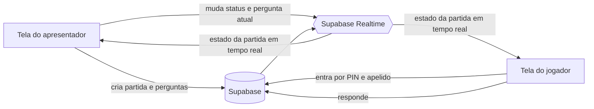

# One-shot prompt para o Lovable — SabeTudo (quiz ao vivo estilo Kahoot)

Prompt completo para colar no Lovable. Reproduz a mecânica do Kahoot: host cria o quiz, plateia entra por PIN e apelido, perguntas com cronômetro, pontuação por velocidade, placar entre perguntas e pódio no fim. Tudo em tempo real, com landing page, painel do host, criador de quiz, telas ao vivo e tela do jogador.

Stack alinhada ao que o Lovable constrói bem: React, TypeScript, Tailwind, shadcn/ui, lucide-react, framer-motion e Supabase com tempo real. Tudo em português, dado de exemplo, sem dado pessoal real.

---

## Objetivo

Construa um web app moderno, divertido e responsivo chamado SabeTudo.

O SabeTudo é uma plataforma de quiz ao vivo, parecida com o funcionamento do Kahoot. Um apresentador cria um quiz, inicia uma partida ao vivo, mostra um PIN na tela principal, e os jogadores entram pelos próprios celulares usando o PIN e um apelido. O apresentador controla a partida pela tela principal. Os jogadores respondem pelo celular. O sistema calcula pontos com base em acerto e velocidade, mostra rankings entre as perguntas e exibe um pódio final.

Resultado principal:
- Apresentador cadastra perguntas, inicia uma partida e conduz pela tela projetada.
- Jogadores entram por PIN e apelido pelo celular e respondem cada pergunta no tempo.
- Pontuação por velocidade, ranking entre perguntas, pódio final.

Fora de escopo (não implementar):
- Login e cadastro de jogador. Entrada é PIN mais apelido apenas.
- Pagamento, planos, cobrança.
- Envio de email, SMS ou notificação push.
- Banco público de quizzes ou importação de quizzes prontos.
- Modo individual assíncrono. O foco é a partida ao vivo conduzida pelo apresentador.

Restrições importantes:
- Use dado de exemplo. Nenhum dado pessoal real.
- Valide toda entrada antes de gravar (PIN existe, apelido não vazio, opção válida).
- Trate estados previsíveis: PIN inválido, partida já começou, partida encerrada, conexão perdida.
- Use variáveis de ambiente para toda configuração (URL e chaves do Supabase). Nunca hardcode chaves no código.
- Use ícones da `lucide-react` para tudo. Nunca renderize emoji na interface.
- Não use travessão (—) em texto de UI ou documentação. Use vírgula, ponto ou dois-pontos.

---

## Logos e identidade da marca

Use os logos do SabeTudo da pasta local do projeto:

```
C:\Projects\unb\aula_vibecoding\roteiro\sabetudo
```

Arquivos disponíveis:
- `sabetudo-logo.png` (logo completo)
- `sabetudo-logo-icone.png` (só o ícone)
- `sabetudo-logo-texto.png` (só a parte de texto)

Regras de uso:
- Logo completo no topo das páginas.
- Ícone sozinho em telas compactas, estados de carregamento, favicon e elementos menores.
- Logo em texto quando o espaço horizontal for limitado.

Identidade visual:
- O app deve parecer divertido, inteligente, energético e fácil de usar.
- Visual adequado para sala de aula, treinamento, evento, workshop e comunidade online.
- Lúdico, mas polido e confiável. Não infantil.

---

## Paleta de cores

Use as cores do logo de forma consistente em toda a interface. Defina os valores como tokens no `tailwind.config` e em variáveis CSS, e use de forma semântica.

Paleta principal:
- Roxo principal: `#371DA2`
- Roxo secundário: `#6545DE`
- Azul principal: `#5F98F4`
- Azul claro: `#AAB0E9`
- Amarelo: `#ECC347`
- Verde de acerto: `#94C65A`
- Rosa de erro ou alerta: `#DA4A71`
- Fundo principal: `#FFFFFF`
- Fundo suave: `#F7F8FF`
- Texto escuro: `#111827`

Regras de uso:
- Roxo é a cor principal de ação.
- Azul é a cor secundária e de estados informativos.
- Amarelo destaca vitória, acerto e momentos de celebração.
- Verde é exclusivo de respostas corretas.
- Rosa ou vermelho é exclusivo de respostas erradas, alertas e erros.
- Não espalhe hex solto pelos componentes. Tudo vem dos tokens.

---

## Tipografia

- `Nunito Sans` para títulos, botões, cards de quiz, perguntas e elementos principais da interface.
- `Inter` para textos menores, formulários, labels, dashboard e informação auxiliar.
- Pesos bold ou extra bold para PIN, cronômetro, pontuação e ranking.
- Tipografia arredondada, amigável, legível, alinhada à energia visual do logo.

---

## Formato das respostas

Cada alternativa tem cor e forma fixas, como num jogo de quiz ao vivo:

- Opção 1: rosa ou vermelho com triângulo
- Opção 2: azul com losango
- Opção 3: amarelo com círculo
- Opção 4: verde com quadrado

Regras:
- Use SVG ou ícones da `lucide-react` para as formas. Não use emoji.
- Na tela do jogador, os botões de resposta são grandes, coloridos e fáceis de tocar (mínimo 44x44px de alvo de toque).
- Na tela do apresentador, as alternativas são grandes e legíveis em projetor.

---

## Stack

Frontend:
- React com TypeScript
- Tailwind CSS com tokens para cores e tipografia
- shadcn/ui quando fizer sentido
- `lucide-react` para todos os ícones
- `framer-motion` para animações simples

Backend e tempo real:
- Supabase para banco (Postgres) e sincronização em tempo real
- Sem autenticação de jogador no MVP

Operação:
- Configuração por variáveis de ambiente: `VITE_SUPABASE_URL`, `VITE_SUPABASE_ANON_KEY`.
- `.gitignore` deve incluir `.env`, `.env.*` (exceto `.env.example`), `.claude/`, `node_modules/`, `dist/`, `build/`.
- Habilite Row Level Security (RLS) em todas as tabelas do Supabase. Crie policies explícitas para cada operação (anônimo pode ler partida pelo PIN, inserir jogador, inserir resposta; apenas host modifica a partida).
- Valide toda entrada antes de gravar.
- Tratamento de erro centralizado com mensagens curtas para o usuário e log estruturado no console.

Na primeira versão, pode usar estado local e dados simulados onde fizer sentido, mas organize o código para conectar com Supabase depois.

---

## Conceitos centrais

Use estes nomes de entidade no código:
- `game`: uma partida. Tem PIN, status e índice da pergunta atual.
- `question`: pergunta da partida, com texto, opções, índice da correta e tempo limite.
- `player`: participante identificado por apelido, com pontuação acumulada e sequência atual de acertos.
- `answer`: resposta de um jogador a uma pergunta, com opção escolhida, tempo de resposta e pontos.

Status da partida (use exatamente estes):
- `lobby`: aceitando jogadores, ainda não começou.
- `question`: pergunta aberta, cronômetro rodando.
- `reveal`: tempo encerrado, mostrando resposta certa e distribuição.
- `leaderboard`: placar entre perguntas.
- `ended`: partida encerrada, pódio.

---

## Modelo de dados (Supabase)

Crie as tabelas necessárias. Toda tabela com RLS habilitada e policies explícitas.

`games`:
- `id`
- `pin` (6 dígitos, único entre partidas que não estão `ended`)
- `status` (`lobby`, `question`, `reveal`, `leaderboard`, `ended`)
- `current_question_index` (int)
- `created_at`

`questions`:
- `id`
- `game_id` (fk)
- `order` (int)
- `text`
- `options` (lista de objetos com `text`, `color`, `shape`)
- `correct_option_index` (int)
- `time_limit_seconds` (int, padrão 20)

`players`:
- `id`
- `game_id` (fk)
- `nickname`
- `score` (int, padrão 0)
- `streak` (int, padrão 0)
- `created_at`

`answers`:
- `id`
- `question_id` (fk)
- `player_id` (fk)
- `selected_option_index` (int)
- `response_time_ms` (int)
- `points` (int)
- `created_at`

Regras de integridade:
- O PIN é único entre partidas que não estão `ended`.
- Um jogador não pode responder a mesma pergunta duas vezes.
- O apelido não pode estar vazio.
- O jogador não pode entrar se a partida já terminou. Se já começou, mostre mensagem clara.
- A pontuação total do jogador é a soma dos pontos das respostas.
- Valide todas as entradas antes de salvar.

---

## Pontuação

Resposta certa recebe pontos por velocidade. Resposta errada recebe 0.

Fórmula:

```
se acertou:
  points = round(1000 * (1 - (response_time_ms / (time_limit_seconds * 1000)) / 2))
senão:
  points = 0
```

Resultado:
- Resposta certa instantânea vale perto de 1000.
- Resposta certa no fim do tempo vale perto de 500.
- Resposta errada vale 0.

Bônus de sequência (streak):
- Acertos consecutivos aumentam um multiplicador pequeno.
- Dois acertos seguidos somam um bônus pequeno; três ou mais aumentam até um teto razoável.
- Errar zera a sequência.

---

## Páginas e rotas

### 1. Landing page · `/`

Topo:
- Logo do SabeTudo.
- Navegação: Recursos, Como funciona, Para professores, Preços, Entrar.

Hero:
- Título: `Jogue. Aprenda. Mostre que sabe.`
- Subtítulo: `O SabeTudo transforma quizzes em jogos ao vivo para salas de aula, equipes, eventos e comunidades online.`
- Botão principal: `Criar quiz`.
- Botão secundário: `Entrar em um jogo`.
- Mockup grande mostrando: tela do apresentador, botões de resposta do jogador, ranking ao vivo.

Como funciona:
1. Crie seu quiz
2. Compartilhe o PIN
3. Jogadores respondem ao vivo
4. Celebre os vencedores

Recursos:
- Salas de jogo ao vivo
- Entrada rápida por PIN
- Perguntas de múltipla escolha
- Cronômetro por pergunta
- Pontuação por velocidade e acerto
- Ranking ao vivo
- Painel do apresentador

Casos de uso:
- Sala de aula
- Treinamento corporativo
- Eventos
- Comunidades online

Chamada final:
- `Pronto para descobrir quem sabe tudo?`

### 2. Painel do apresentador · `/host`

O apresentador pode:
- Ver quizzes existentes.
- Criar novo quiz.
- Editar quiz.
- Iniciar jogo ao vivo.
- Ver jogos recentes.
- Ver estatísticas simples: total de quizzes, jogos realizados, pontuação média, jogadores recentes.

### 3. Criador de quiz · `/host/builder`

Fluxo completo de cadastro de perguntas. O apresentador deve conseguir:
- Cadastrar título do quiz.
- Cadastrar descrição.
- Escolher categoria.
- Adicionar, editar e remover perguntas.
- Adicionar de 2 a 4 opções de resposta.
- Escolher a resposta correta.
- Definir tempo limite.
- Escolher modo de pontuação: padrão ou bônus por velocidade.
- Pré-visualizar pergunta.
- Salvar quiz.

Validações:
- Quiz tem título.
- Cada pergunta tem texto.
- Cada pergunta tem pelo menos 2 opções.
- Cada pergunta tem exatamente uma resposta correta.
- Cada opção tem texto.

### 4. Tela ao vivo do apresentador · `/host/[pin]`

Tela principal, pensada para projetor. Muda conforme o status da partida.

Estado `lobby`:
- Logo do SabeTudo.
- PIN bem grande.
- Instrução: `Entre no SabeTudo e digite este PIN.`
- Placeholder de QR Code.
- Número de jogadores.
- Apelidos entrando em tempo real.
- Botão `Começar jogo`, habilitado quando houver pelo menos 1 jogador.

Estado `question`:
- Pergunta em destaque.
- Cronômetro grande.
- Alternativas com cor e forma.
- Contador de quantos já responderam.
- Não mostre a resposta correta ainda.

Estado `reveal`:
- Destaca a resposta correta.
- Distribuição de respostas por alternativa, em gráfico de barras com as cores e formas.
- Botão para ir ao ranking.

Estado `leaderboard`:
- Top 5 jogadores: posição, apelido, pontos e sequência de acertos.
- Botão `Próxima pergunta` quando ainda houver perguntas.
- Botão `Resultado final` quando o quiz acabar.

Estado `ended`:
- Pódio final com os 3 primeiros.
- Ranking completo abaixo.
- Botões: `Jogar novamente`, `Criar novo quiz`, `Voltar ao painel`.

### 5. Entrada do jogador · `/entrar`

Página mobile-first. Campos:
- PIN do jogo.
- Apelido.

Validação:
- PIN precisa existir.
- Apelido não pode estar vazio.
- Se o jogo já terminou, mostre mensagem clara.
- Se o jogo já começou, mostre mensagem clara e ofereça voltar.

Depois de entrar, redireciona para `/jogar/[gameId]`.

### 6. Tela do jogador · `/jogar/[gameId]`

Mobile-first, reage ao status da partida.

Estado `lobby`:
- Tela de espera.
- Apelido visível.
- Mensagem: `Aguardando o apresentador começar.`

Estado `question`:
- Pergunta.
- Quatro botões grandes de resposta. Cada botão usa a cor e a forma da alternativa.
- Ao tocar: desabilita todos os botões, salva a resposta, mostra confirmação `Resposta recebida. Aguardando próxima tela.`

Estado `reveal`:
- Acertou ou errou.
- Pontos ganhos.
- Pontuação atual.
- Posição atual, se disponível.

Estado `leaderboard`:
- Resumo do ranking.
- Destaca o jogador atual.
- Mensagem: `Próxima pergunta em instantes.`

Estado `ended`:
- Posição final.
- Pontuação final.
- Pódio ou top 5.
- Botão para entrar em outro jogo.

---

## Componentes

Implemente como componentes pequenos e reutilizáveis:

- `AppShell`
- `Header`
- `HeroSection`
- `FeatureCards`
- `HowItWorks`
- `CTASection`
- `HostDashboard`
- `QuizBuilder`
- `QuestionEditor`
- `AnswerOptionCard`
- `GameLobbyHost`
- `LiveQuestionHost`
- `RevealHost`
- `LeaderboardHost`
- `FinalPodiumHost`
- `PlayerJoin`
- `PlayerLobby`
- `PlayerQuestion`
- `PlayerAnswerButton`
- `PlayerReveal`
- `PlayerLeaderboard`
- `PlayerFinalResults`
- `Timer`
- `GamePinDisplay`
- `QRCodePlaceholder`
- `ScoreBadge`
- `StreakBadge`

---

## Tempo real

- O status do jogo na tabela `games` é a fonte da verdade.
- Use Supabase Realtime para propagar mudanças.
- Quando o apresentador muda o status, todas as telas dos jogadores atualizam.
- Quando um jogador entra, o lobby do apresentador atualiza.
- Quando um jogador responde, o contador de respostas do apresentador atualiza.
- Quando todos respondem ou o tempo acaba, o apresentador pode avançar para o reveal.
- Se o jogador desconectar e voltar, ele retorna ao estado atual da partida.

---

## Interações obrigatórias

- Botão `Criar quiz` abre o criador de quiz.
- Botão `Entrar em um jogo` abre a tela de entrada do jogador.
- Apresentador cadastra e salva perguntas.
- Apresentador inicia um jogo e o sistema gera o PIN.
- Apresentador vê as perguntas na tela principal.
- Jogador vê as opções no próprio celular.
- Jogador responde cada pergunta apenas uma vez.
- Ranking atualiza depois de cada pergunta.
- Pódio final aparece no fim.
- Transições suaves entre lobby, pergunta, reveal, ranking e resultado final.

---

## Responsividade

- A landing page funciona bem no desktop e no mobile.
- A tela do apresentador funciona em tela grande e projetor.
- A experiência do jogador é mobile-first.
- Evite telas apertadas. Botões grandes, hierarquia visual clara, textos legíveis.

---

## Animações

Use `framer-motion` com moderação:
- Cronômetro com animação visível.
- Entrada de jogadores no lobby com animação pequena.
- Revelação da resposta correta com animação simples.
- Pódio final com animação.
- Sem exagero. Cada animação tem função.

---

## Estados obrigatórios

- Carregando.
- Nenhum quiz criado.
- PIN inválido.
- Apelido vazio.
- Jogo já iniciado.
- Jogo encerrado.
- Conexão perdida.
- Nenhum jogador ainda.
- Nenhuma resposta ainda.

---

## Tom dos textos

Amigável, energético, simples e confiante. Frases curtas.

Exemplos do vocabulário:
- `Criar quiz`
- `Começar jogo`
- `Entrar com PIN`
- `Escolha sua resposta`
- `Resposta recebida`
- `Você acertou`
- `Quase lá`
- `Ranking`
- `Pódio final`

---

## Segurança e operação

- Habilite RLS em todas as tabelas (`games`, `questions`, `players`, `answers`).
- Crie policies explícitas: o anônimo lê `games` por PIN, insere `players`, insere `answers` próprios; só o host modifica `games` e cria `questions`.
- Variáveis de ambiente para a configuração do Supabase. Nada de chave hardcoded.
- CORS configurado, não use `*` em produção.
- Sanitize o apelido antes de gravar (limite de tamanho, remova caracteres de controle).
- Erros no usuário são mensagens curtas e genéricas. Detalhes ficam no log do servidor.

---

## Atribuição da desenvolvedora

Inclua em todo o app:

Comentário HTML no topo do `<body>` da página principal:

```html
<!--
    ================================================================

    ❤️ This website was developed with love and dedication by Jady Pamella
    🌐 Portfolio: https://jadypamella.com

    ================================================================
-->
```

`console.log` no arquivo principal de inicialização (`main.tsx` ou equivalente):

```ts
console.log(
  '❤️ This website was developed with love and dedication by Jady Pamella\n🌐 Portfolio: https://jadypamella.com'
);
```

Os emojis acima são a única exceção à regra de não usar emoji. Eles ficam apenas no comentário HTML e no `console.log`, nunca na interface visível.

---

## README e documentação

Inclua um `README.md` na raiz do projeto explicando:
- O que o SabeTudo faz, em uma frase.
- Stack usada.
- Como rodar local (variáveis de ambiente, comando de start).
- Como o tempo real funciona (status do jogo na tabela `games` propaga via Supabase Realtime).
- Como testar (criar quiz, iniciar partida, entrar como jogador em outra aba).

---

## Definição de pronto

Apresentador:
- Cria um quiz com várias perguntas.
- Inicia um jogo e gera PIN.
- Vê o PIN, o lobby em tempo real, conduz pergunta a pergunta, vê reveal, placar e pódio.

Jogador:
- Entra por PIN e apelido pelo celular.
- Vê acerto, pontos e posição.

Jogo:
- Pontuação por velocidade funciona.
- Placar atualiza entre perguntas.
- Pódio aparece no fim.
- Tempo real sincroniza apresentador e jogadores.

Identidade:
- Logo, paleta e fontes do SabeTudo aplicados de forma consistente.
- Nenhum emoji na interface (apenas no comentário HTML e no `console.log` de atribuição).
- Nenhum travessão (—) em textos da UI.
- Ícones todos de `lucide-react`.

Operação:
- Configuração por variáveis de ambiente.
- RLS habilitada em todas as tabelas com policies explícitas.
- `.gitignore` correto.
- Dado de exemplo, nenhum dado pessoal real.
- App responsivo e pronto para demonstração.

---

## Diagrama de fluxo



---

## Como construir ao vivo

A decisão para esta aula é construir o SabeTudo na frente da plateia, do zero, usando este prompt. Não há versão pré-construída substituindo o demo. O que segue é a mecânica para que isso aconteça bem.

Cole o prompt inteiro no Lovable de uma vez. Não vá pedindo parte por parte ao vivo. Um one-shot bem preenchido é o que faz o primeiro resultado já sair perto do final.

Fluxo esperado na aula:
- Cole o prompt no minuto 4 da aula.
- O Lovable gera. Você narra slides (vibecoding, ciclo, dissecação do prompt) enquanto ele trabalha. Tempo típico do primeiro resultado: 3 a 6 minutos.
- Resultado 1 aparece. Provavelmente tem furo (tempo real não sincroniza, ou criar quiz não funciona, ou as cores das opções não saíram certas). Você corrige com 1 ou 2 prompts curtos, narrando mais slides nas esperas.
- Quando o app estiver com lobby funcionando e ao menos uma pergunta jogável, você cria 3 a 5 perguntas curtas sobre o conteúdo da aula e publica.
- A plateia entra pelo celular com o PIN, joga, e o pódio aparece. Esse é o pico.

Salvaguardas obrigatórias:
- Teste este prompt uma vez, 1 a 2 dias antes da aula. Não é "construir antes da aula", é QA do prompt. Você precisa saber quantas correções são típicas e onde costuma engasgar.
- Tenha o resultado desse teste salvo numa aba escondida do navegador como rede de segurança. Se o build ao vivo travar feio e não recuperar em 2 correções, abra a rede e fale com a sala: "deixei essa versão adiantada no interesse do tempo, mesma técnica, mais iterações". A plateia ainda joga, o pico acontece igual.
- Se mesmo a rede de segurança não funcionar, encerre o demo de construção e migre para a votação simples de uma pergunta do `prompts_demo.md` #1, que é de risco baixo. Melhor uma votação que funciona do que um SabeTudo travado.

O risco número um é tempo real multiusuário não sincronizar quando a sala inteira entra junta. Teste isso com pelo menos 3 celulares no QA.

O risco número dois é o tempo da aula acabar antes do app ficar jogável. Por isso a regra: no minuto 40 da aula, se ainda não dá para a plateia jogar, abra a rede de segurança.
